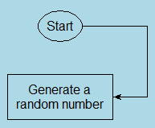
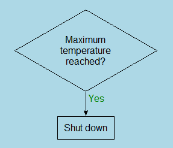

## Screenshot of the FlowChart GUI

## Creating commands for flowchart

* The commands can either be typed in the "Text for Commands" widget, or, can be created in the "GUI for Commands"
  widget in the cropped-images shown below.
  
  
  
  
  
* The widgets can be switched at any time and the contents of the current widget are updated automatically. See an example below:
  
  

## Commands:

The commands are explained here using the gui-commands widget so that we can see the available options for each command.
Currently, the following commands are available:

1. start
2. stop
3. operation
4. decision
5. connection
6. delete
7. delete-all
8. title
9. box
10. font
11. connector

## Commands in detail:

### 1. The *start* command

* It puts a start-box as shown in the following figure:
  
  
  
* The following figure shows the different settings available in the "start" command:
  
  
* **name**:
  * It is an entry used to specify name for a box (i.e start, stop, operation, decision).
  * Every box command should be given a unique name, because, this name is used in connections between boxes.
  * In the above image, the name "start-box" is given to it.
* **placement**:
  * This is used to specify where to place the current box.
  * It has two parts, both of which are comboboxes as shown in the figure.
  * The first combobox lists the available names, these are the names given to different boxes in all the commands.
  * The second combobox lists the four directions: north, east, west and south.
  * If the name of a box is chosen along with a direction (say east),
    then the current box is placed towards east of the chosen box.
  * If they are left empty, the new box is placed under(i.e. south of) the bottom-most object on canvas.
* **dx** and **dy**:
  * After placing the current box, *dx* and *dy* specify the number of pixels to move the box.
  * For example, choosing *10* for *dx* and *20* for *dy* moves the placed box 10 pixels to the right and
    20 pixels towards down.

### 2. The *stop* command

* This is similar to the "start" command except that it puts a "stop" box on canvas as shown below.
  
  
* The following image shows the settings available with the "stop" command.
  Notice the similarity with the "start" command.
  
  

### 3. The *operation* command

* This puts an operation box on the canvas with text inside text as shown in the following figure.
  
  
* The following image shows the settings available with the "operation" command.
  
  
* In the above image, all settings except the "text" are already seen in the "start" command. They are exactly the same.
* The "text" setting specifies the text to be put inside the box. In the above image, it is "Generate a random number"
  with a line break in the middle. The new line character is not visible in the above image, but, if we switch to
  "text-commands" widget, it is visible (see image below)
  
  

### 4. The *decision* command

* This is used to draw a decision box on the canvas as shown in the following figure:
  
  
* The settings available with "decision" command are same as that of the "operation" command above.
* There is just one extra setting named "angle". This is used to specify the acute angle of the decision box.
  By default, it is 60 degrees.

### 5. The *connection* command

* This is used to draw a connection between two boxes on the canvas as shown in the following figure
  
  
* The settings available with the "connection" command are shown in the following figure:
  
  
* **start** and **end**:
  * These are similar in form to the "placement" setting seen earlier.
  * Both have two inner comboboxes, one each for name and direction.
  * In the above image, it is specified that the connection be drawn from the "south" of the "start-box" to
    the "north" of the "rand-num-gen" box.
* **points**:
  * Intermediate points can be added to a connection using this as shown in the following figure:
    
    
  * In the above image, excluding the start and end points of the connection, there are two intermediate points
    where the connection bends. These are specified using points as shown in the following figure:
    
    
  * Notice that the direction in both "start" and "end" is changed to "east" in the above image.
  * An intermediate point can be added by clicking the "+" button.
  * Each point has the format "(x_type, x_delta), (y_type, y_delta)"
  * There are 5 available options for x_type. They are start_x, end_x, min_x, max_x, mid_x.
    Similar ones are available for y_type.
    * start_x: This is the x-coordinate of the point where the connection starts
    * end_x: This is the x-coordinate of the point where the connection ends
    * min_x: This is the minimum of the above two
    * max_x: This is the maximum of the two
    * mid_x: This is the average of the two
  * x_delta and y_delta are integers to add to them
  * In the above example, the two added intermediate points are
    * ("start_x" + 80, "start_y" + 0)
    * ("start_x" + 80, "end_y" + 0) - using the same x as the above intermediate point
* **label**, **label-dx**, **label-dy**, **label-color**:
  * These can be used to put labels beside connections as shown in the following figure:
    
    
  * In the above image, label is the text "Yes", label-dx and label-dy are used to position the label,
    label-color is green.

### 6. The *delete* command
* The delete command can be used to delete a box using its name
* The following shows a delete command
  
  
* This may not be useful now, it was previously useful when there was an option to run commands one-by-one. In future,
  the run commands one-by-one will be re-added.

### 7. The *delete-all* command
* This deletes everything on canvas.
* It has no additional settings inside it.

### 8. The *title* command
* This can be used to set the title at the top-left of the gui.
  For example the following image shows it being changed to "Hello World"
  
  

### 9, 10, 11: The *box*, *font*, *connector* commands:
* These are self explanatory.
* They are used to set width of boxes, font-size and font-weight, and width of connections.
* They are sticky, in that, once set, they persist until the end of the program unless changed again.
