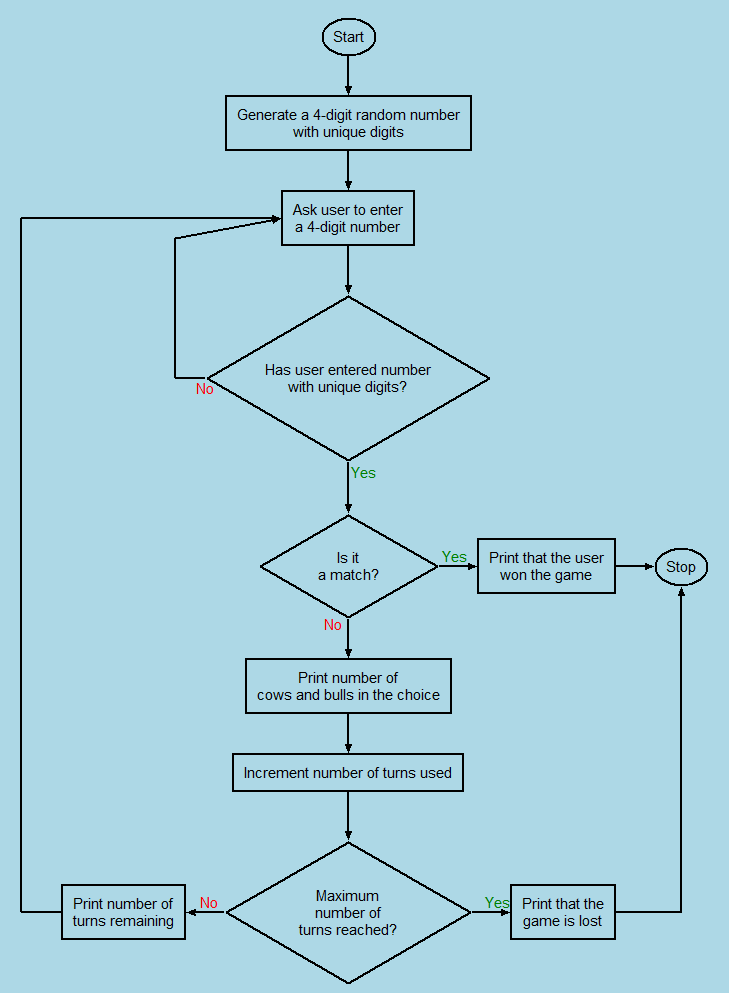

# Simple Flow Chart

This is a simple flowchart builder program.
It is a GUI made with python's tkinter.

This program can be used to create simple flow charts and save them as vector images. (See example below)

The flowcharts are created as commands. That is, flow-chart-boxes(start, stop, operation, decision), connections,
and other settings like text-color etc are given as individual commands.

These commands can be written directly in the text-commands widget, or created using the gui-commands widget.
Traversing between the two widgets automatically updates the commands, in other words,
any of the two can be used at any time without loss of commands data.

Learn more from [documentation](docs/documentation.md).

## Example:

A flowchart of a game named Cows and Bulls created using the GUI:

The commands json file for the above flowchart is present inside docs/examples folder.
